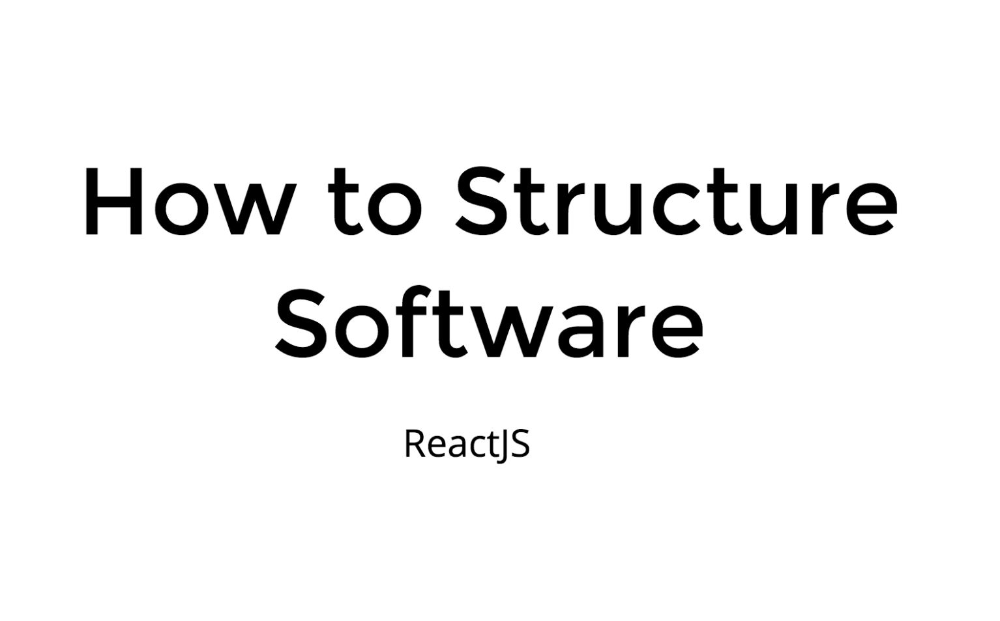

# How to structure Software (react) 

## Presentation

[Link to the original slides](https://slides.com/florianboehmak/deck)

[downolad as PDF](documentation/How-to-structure-Software-(ReactJS).pdf)

[read more](documentation/README.md)

## Setup

### Firebase Credentials

- visit https://firebase.google.com/ and create a Firebase Portal
- copy and paste your Credentials from your Firebase Portal into .env file (use .env.template)
- copy your projectID from Firebase Portal into .firebaserc
- activate Email/Password Sign-In Method in your Firebase Portal

### Paypal Credentials

- visit https://developer.paypal.com/ and create a REST API account
- copy and paste your Credentials from your Paypal Sandbox Portal into .env file 

## Installation

- `yarn install`
- `yarn start`
- visit http://localhost:3000/
- Use your own Firebase Credentials (create .env file)

## Deployment

- `yarn build`
- `firebase deploy`

## Demo

https://buyer-seller-6075a.firebaseapp.com/

