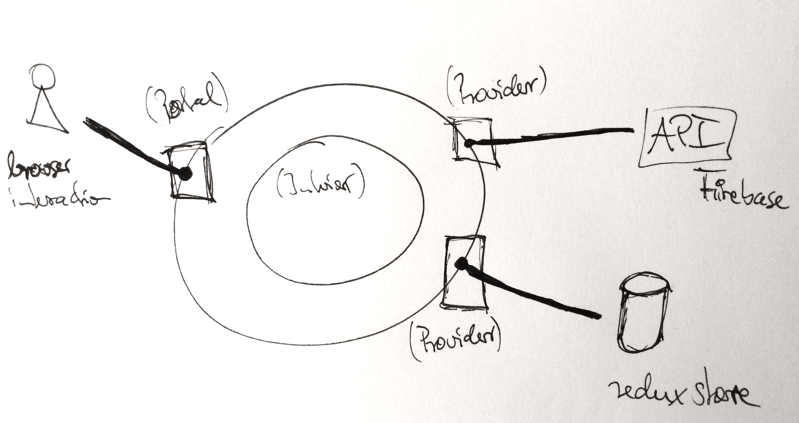
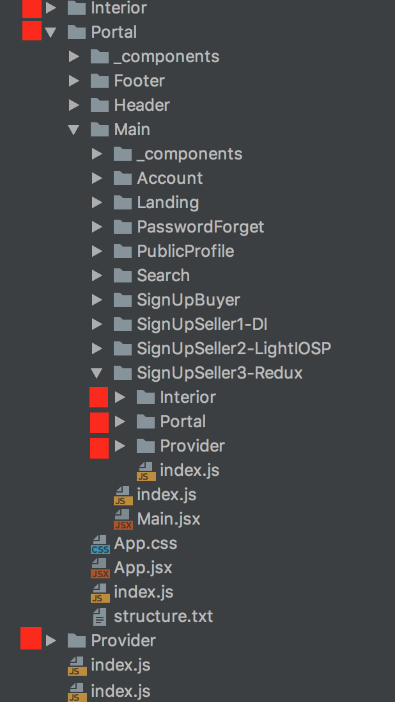

# Documentation

## Presentation

[How-to-structure-Software-(ReactJS).pdf](How-to-structure-Software-(ReactJS).pdf)

## Software Cell

- Portal
- Provider
- Interior

## File Structure of the Project

Everythink is a software cell - be it the whole app or be it a component in a lower abstraction level! Can you find the software cells (Portal, Interior, Provider)? :-)

Additional information about Flow-Design, Softwarezellen und Softwareuniversum in the free ebook: [thearchitectsnapkin-derschummelzettel](https://leanpub.com/thearchitectsnapkin-derschummelzettel)
